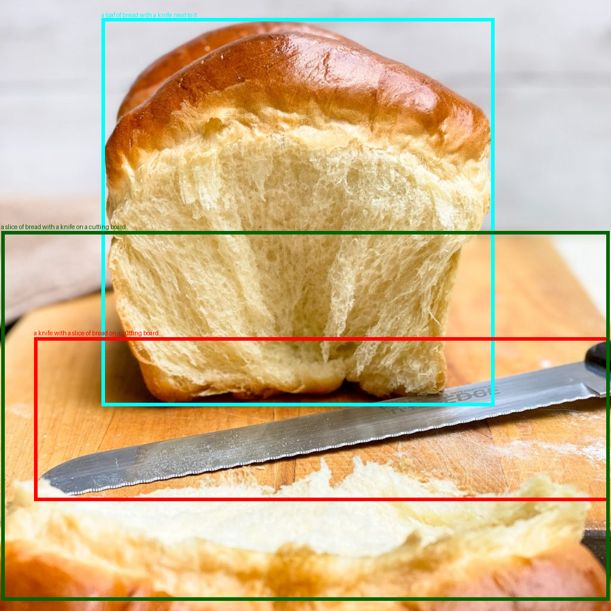
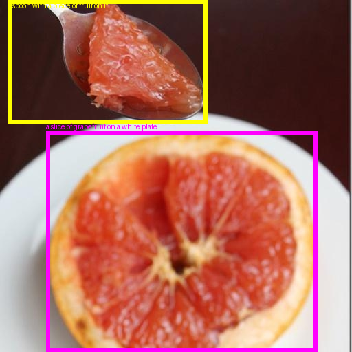

# **MIGLoRA - Efficient Multi-Instance Generation with Janus-Pro-Dirven Prompt Parsing**  

In accordance with the ICCV double-blind review process and academic publication guidelines, we are currently unable to disclose technical details and experimental data related to this paper. To facilitate reproducibility in academic exchange, we have uploaded partial materials to an anonymous research platform. Should this paper be accepted by the conference, we commit to completing the following open-source initiatives upon receiving official acceptance notification:
- [ ]The complete codebase will be hosted on GitHub under the MIT License
- [ ]Pretrained model weights and configuration files will be released via Hugging Face Model Hub
- [ ]The full dataset will be made available through Hugging Face Datasets

## **Dataset Samples**  
Here are some sample images from our dataset:  

### 📂 1024px Samples  
  

### 📂 512px Samples  
  

📌 **Follow us for the latest updates and releases!**  
